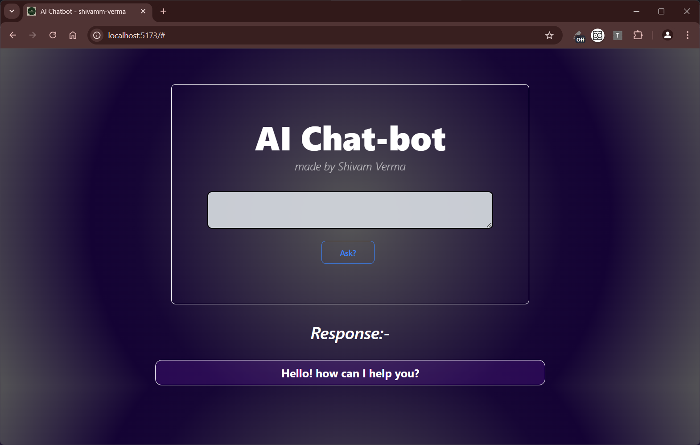
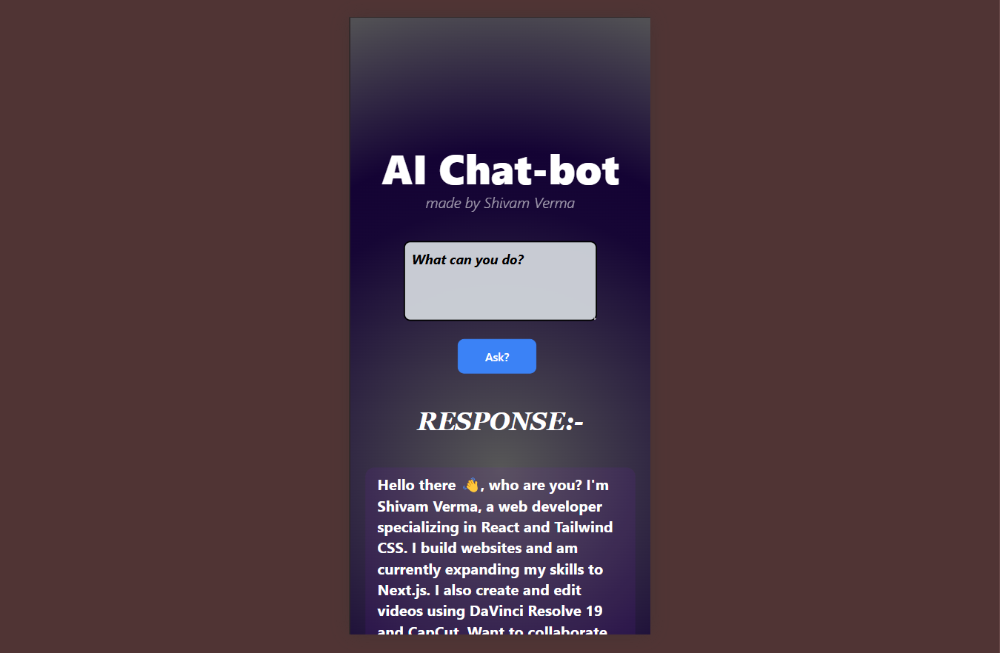

# *AI Chat-bot*
The **AI Chatbot** is a personal assistant designed to help you connect with me, **Shivam Verma**. Built using **React.js** and **Tailwind CSS**, it provides quick access to my social media handles and email for direct contact. The chatbot uses an **AI API** to respond intelligently to your queries, making interactions smooth and efficient. Whether you need to reach out or find my online profiles, the chatbot offers a fast, user-friendly way to get the information you need. This project combines modern web technologies with AI to simplify communication and ensure easy access to my details.
 

### ➡️[*Deployed here*](https://link)

### What it uses?
- React.js
- Tailwind CSS
- AI API Key

### What it offers?
- Shivam Verma(me), Personal assistance.
- You can ask thing about me, my work and my hobbies.
- This will also give you my social handles and mail if asked.
- Responsive design, designed for both phone and laptops.

### Screenshots

Laptop

Mobile

### About this Repository

