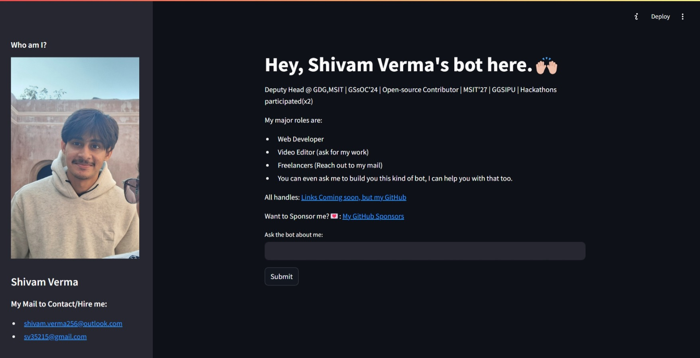

# *MyAI Chat-bot*
This AI Chatbot uses `llama3-8b-8192` and can also  use other models and passes the given context to pass the question through groq api and get the answer with the given context.
Ask my [bot](#screenshots) about me, and it will provide you with an answer just as I would! 🙌🏼✨

 

### ➡️ *Ask my bot here!⤵️*

### What it uses?
- Streamlit (For bringing Application to the user, beautifully)
- groq API (Most Fastest API)
- Python

### What it offers?
- Shivam Verma(me), Personal assistance.
- You can ask thing about me, my work and my hobbies.
- This will also give you my social handles and mail if asked.
- Responsive design, as deployed by streamlit.

### 📸Screenshots

Mobile

Laptop

### About this Repository

